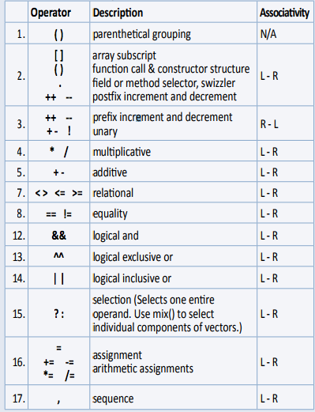
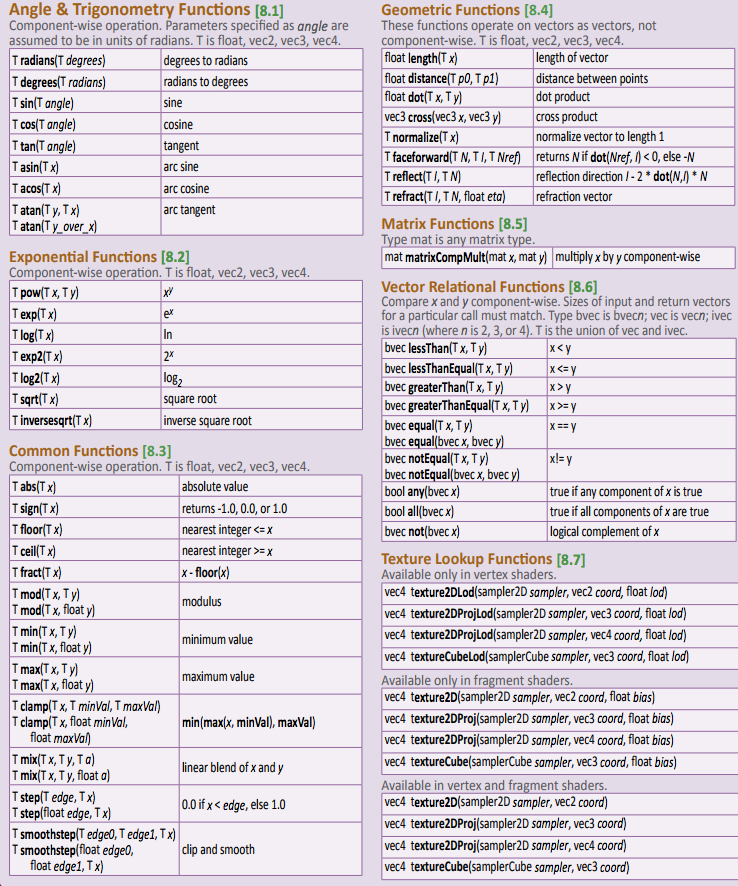
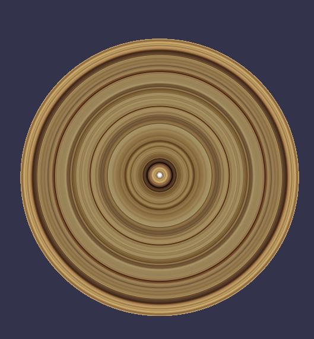

# babylon-shader

#### webgl Shader 混个脸熟


1、一般分为两部分

​	1.1 顶点着色器  Vertex Shader

```
attribute vec4 position;
varying vec4 fragColor;
uniform float elapsedTime;
void main() {
    fragColor = position * 0.5 + 0.5;
    float rotateAngle = elapsedTime * 0.001;
    float x = position.x * cos(rotateAngle) - position.y * sin(rotateAngle);
    float y = position.x * sin(rotateAngle) + position.y * cos(rotateAngle);
    gl_Position = vec4(x, y, 0.0, 1.0);
}
```

​	1.2 片元着色器  Fragment Shader

```
varying mediump vec4 fragColor;
void main() {
    gl_FragColor = fragColor;
}
```

#### webgl Shader 变量

- `void` 和C语言的void一样，无类型
- `bool` 布尔
- `int` 有符号的int
- `float` 浮点数
- `vec2`, `vec3`, `vec4` 2，3，4维向量，如果你不知道什么是向量，可以理解为2，3，4长度的数组。
- `bvec2`, `bvec3`, `bvec4` 2，3，4维布尔值的向量。
- `ivec2`, `ivec3`, `ivec4` 2，3，4维int值的向量。
- `mat2`, `mat3`, `mat4` 2x2, 3x3, 4x4 浮点数的矩阵，如果你不了解矩阵，后面会有一篇文章单独介绍矩阵。
- `sampler2D` 纹理，后面会详细介绍。
- `samplerCube` Cube纹理，后面会详细介绍

其它变量：

- `attribute` 顶点数据
- `uniform` 变量会被所有Shader共享
- `varying` 变量会把 指定的值 从Vertex Shader传递到Fragment Shader中，在Fragment Shader中实现会更加细腻，比如光照效果。


> Vertex Shader 顶点着色器 可以接受 包括 attribute 在内的 所有变量，每个顶点都会触发调用
>
> Fragment Shader 片元着色器 可以接受 除了 attribute 之外的 所有变量，每人像素都会触发调


#### webgl Shader 变量精度

- `highp`, 16bit，浮点数范围`(-2^62, 2^62)`，整数范围`(-2^16, 2^16)`
- `mediump`, 10bit，浮点数范围`(-2^14, 2^14)`，整数范围`(-2^10, 2^10)`
- `lowp`, 8bit，浮点数范围`(-2, 2)`，整数范围`(-2^8, 2^8)` 

Fragment Shader是逐像素执行，所以会尽量控制计算的复杂度。对于不需要过高精度的变量，可以手动指定精度从而提高性能。如果你想所有的float都是高精度的，可以在Shader顶部声明`precision highp float;`，这样你就不需要为每一个变量声明精度了。


#### webgl Shader 变量分量

- `vec4.xyzw`, 
- `vec4.rgba`, 
- `vec4.stpq`,  


#### webgl Shader 运算符




#### webgl Shader 内置方法




#### BabylonJS Shader 中shader 写法实践ABC

- `ShaderMaterial(name, scene, option)`, 
- `option`, 
- `常用变量。。。world,worldViewProjection, on";"normal";"tangent";"uv";"uv2";"uv3";"uv4";"uv5";"uv6"`, 


#### webgl Shader 事例截图



