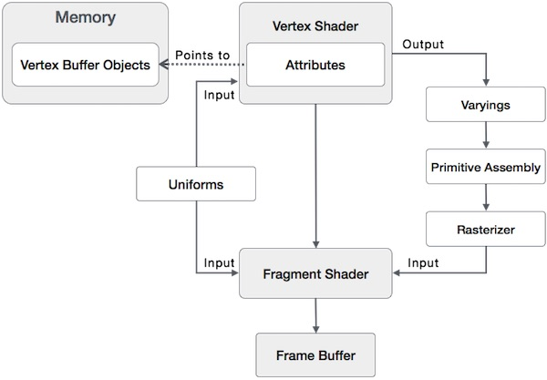
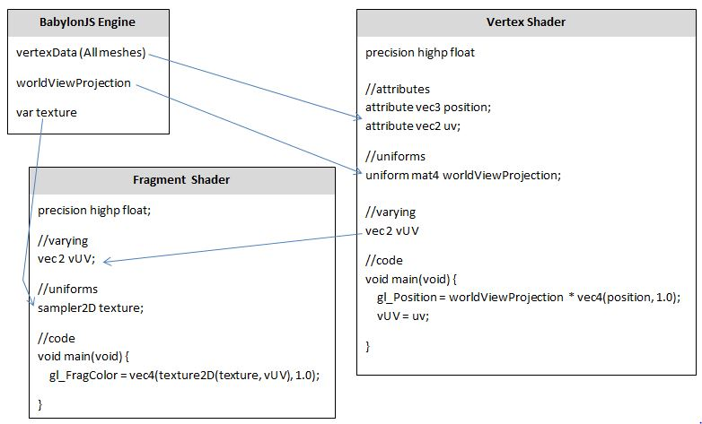

# babylon-shader


#### webgl Shader 混个脸熟


1、一般分为两部分

​	1.1 顶点着色器  Vertex Shader

```
attribute vec4 position;
varying vec4 fragColor;
uniform float elapsedTime;
void main() {
    fragColor = position * 0.5 + 0.5;
    float rotateAngle = elapsedTime * 0.001;
    float x = position.x * cos(rotateAngle) - position.y * sin(rotateAngle);
    float y = position.x * sin(rotateAngle) + position.y * cos(rotateAngle);
    gl_Position = vec4(x, y, 0.0, 1.0);
}
```

​	1.2 片元着色器  Fragment Shader

```
varying mediump vec4 fragColor;
void main() {
    gl_FragColor = fragColor;
}
```


数据流



#### webgl Shader 变量

- `void` 和C语言的void一样，无类型

- `bool` 布尔

- `int` 有符号的int

- `float` 浮点数

- `vec2`, `vec3`, `vec4` 2，3，4维向量，如果你不知道什么是向量，可以理解为2，3，4长度的数组。

- `bvec2`, `bvec3`, `bvec4` 2，3，4维布尔值的向量。

- `ivec2`, `ivec3`, `ivec4` 2，3，4维int值的向量。

- `mat2`, `mat3`, `mat4` 2x2, 3x3, 4x4 浮点数的矩阵，如果你不了解矩阵，后面会有一篇文章单独介绍矩阵。

- `sampler2D` 纹理，后面会详细介绍。

- `samplerCube` Cube纹理，后面会详细介绍

  | S.No. | Type                | Description                          |
  | ----- | ------------------- | ------------------------------------ |
  | 1     | void                | 代表一个空值                               |
  | 2     | bool                | Accepts true or false.               |
  | 3     | int                 | This is a signed integer data type.  |
  | 4     | float               | This is a floating scalar data type. |
  | 5     | vec2, vec3, vec4    | n-component floating point vector    |
  | 6     | bvec2, bvec3, bvec4 | Boolean vector                       |
  | 7     | ivec2, ivec3, ivec4 | signed integer vector                |
  | 8     | mat2, mat3, mat4    | 2x2, 3x3, 4x4 float matrix           |
  | 9     | sampler2D           | Access a 2D texture                  |
  | 10    | samplerCube         | Access cube mapped texture           |

其它变量：

- `attribute` 顶点数据
- `uniform` 变量会被所有Shader共享
- `varying` 变量会把 指定的值 从Vertex Shader传递到Fragment Shader中，在Fragment Shader中实现会更加细腻，比如光照效果。


> Vertex Shader 顶点着色器 可以接受 包括 attribute 在内的 所有变量，每个顶点都会触发调用
>
> Fragment Shader 片元着色器 可以接受 除了 attribute 之外的 所有变量，每人像素都会触发调

| S.No. | Qualifier     | Description                              |
| ----- | ------------- | ---------------------------------------- |
| 1     | **attribute** | This qualifier acts as a link between a vertex shader and OpenGL ES for per-vertex data. The value of this attribute changes for every execution of the vertex shader. |
| 2     | **uniform**   | This qualifier links shader programs and the WebGL application. Unlike attribute qualifier, the values of uniforms do not change. Uniforms are read-only; you can use them with any basic data types, to declare a variable.**Example** − uniform **vec4** lightPosition; |
| 3     | **varying**   | This qualifier forms a link between a vertex shader and fragment shader for interpolated data. It can be used with the following data types − float, vec2, vec3, vec4, mat2, mat3, mat4, or arrays.**Example** − varying **vec3** normal; |

#### webgl Shader 变量精度

- `highp`, 16bit，浮点数范围`(-2^62, 2^62)`，整数范围`(-2^16, 2^16)`
- `mediump`, 10bit，浮点数范围`(-2^14, 2^14)`，整数范围`(-2^10, 2^10)`
- `lowp`, 8bit，浮点数范围`(-2, 2)`，整数范围`(-2^8, 2^8)` 

Fragment Shader是逐像素执行，所以会尽量控制计算的复杂度。对于不需要过高精度的变量，可以手动指定精度从而提高性能。如果你想所有的float都是高精度的，可以在Shader顶部声明`precision highp float;`，这样你就不需要为每一个变量声明精度了。

### Predefined Variables

OpenGL ES SL provides the following predefined **variables for vertex shader** −

| S.No. | Variables                        | Description                              |
| ----- | -------------------------------- | ---------------------------------------- |
| 1     | highp vec4 gl_Position;          | Holds the position of the vertex.        |
| 2     | mediump float      gl_PointSize; | Holds the transformed point size. The units for this variable are pixels. |

OpenGL ES SL provides the following predefined **variables for fragment shader** −

| S.No. | Variables                      | Description                              |
| ----- | ------------------------------ | ---------------------------------------- |
| 1     | mediump vec4 **gl_FragCoord**; | Holds the fragment position within the frame buffer. |
| 2     | bool gl_FrontFacing;           | Holds the fragment that belongs to a front-facing primitive. |
| 3     | mediump vec2 gl_PointCoord;    | Holds the fragment position within a point (point rasterization only). |
| 4     | mediump vec4 gl_FragColor;     | Holds the output fragment color value of the shader |
| 5     | mediump vec4 gl_FragData[n]    | Holds the fragment color for color attachment **n**. |

#### webgl Shader 变量分量

- `vec4.xyzw`, 
- `vec4.rgba`, 
- `vec4.stpq`,  


#### webgl Shader 运算符


#### webgl Shader 内置方法


#### BabylonJS Shader 中shader 写法实践ABC




**shaderMaterial 类的基本结构**


- `ShaderMaterial(name, scene,shaderPath, option)`, 

```
options{
	needAlphaBlending:false,
	needAlphaTesting:false,
	attributes:["position", "normal", "uv"],
	uniforms:["worldViewProjection"],
	samplers:[],
	defines:[]
}
```

```
attributes:"postion";"normal";"tangent";"uv";"uv2";"uv3";"uv4";"uv5";"uv6"
```

```
uniforms:world,worldView,worldViewProjection,view,projection,viewProjection
```

```
Method:
setTexture
setTextureArray
setFloat
setFloats
setColor3
setColor4
setVector2
setVector3
setVector4
setMatrix
setMatrix2x2
setMatrix3x3
setArray3
```

**shaderMaterial 加载 shader code**
方法一：
```
shaderPath {
  	vertexElement:'vertexNodeID',
  	fragmentElement:'fragmentNodeID'
}
for
<script type="application/vertexShader" id="vertexNodeID"> ... </script>
<script type="application/fragmentShader" id="fragmentNodeID"> ... </script>
```

方法二：
```
shaderPath {
  	vertex:'xxxx',
  	fragment:'yyyy'
}
for
BABYLON.Effect.ShadersStore["xxxxVertexShader"]
BABYLON.Effect.ShadersStore["yyyyFragmentShader"]
```


**CustomProceduralTexture 基本结构**
```
BABYLON.CustomProceduralTexture(name, texturePath, siz, 1024, scene);
```

```
BABYLON.Engine.ShadersRepository="dir1/dir2/custom";
BABYLON.CustomProceduralTexture(name, "customxx", 1024, scene);
for


#dir1/dir2/custom
customxx.fragment.fx
customxx.vertex.fx
config.json
{
	"animation": false,
	"refreshrate":0,
	"uniforms":[
		{
			"type":"float",
			"name":"dirAmplifier",
			"value":"6.0"
		}
	],
	"sampler2Ds":[
		{
			"sampler2Dname":"dirt",
			"textureRelativeUrl":"../images/crate.png"
		}
	]
}
```

#### webgl Shader 事例截图


【参考】

https://www.tutorialspoint.com/webgl/webgl_quick_guide.htm  WebGL 教程